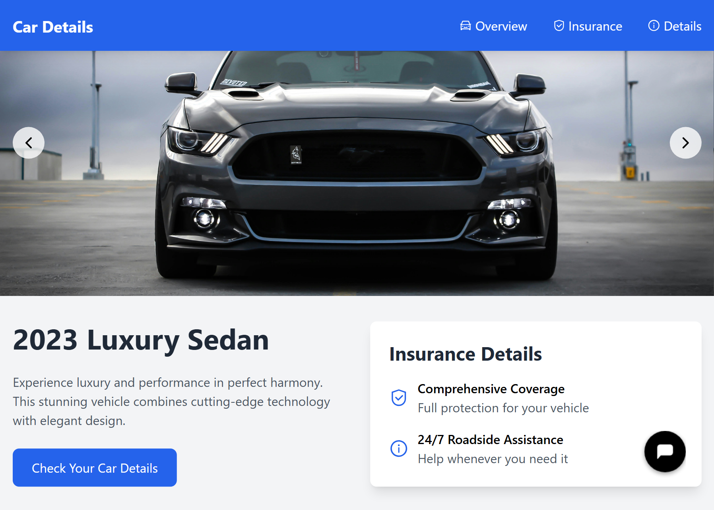

# Automated Car Insurance

### [Visit the Website](https://automated-car-insurance-startup.netlify.app/)

---

## Introduction

**Automated Car Insurance** is a cutting-edge web application designed to simplify and automate the car insurance process. By leveraging advanced technologies such as YOLOv8, React.js, and Firebase, the platform provides seamless features to enhance user experience, from car damage detection to insurance filing.

----
 


---

## Key Features

### 1. **Car Damage Detection with Cost Estimation**
💡 *Powered by YOLOv8 for Damage Detection and Segmentation.*
- Quickly detects damage to your car through uploaded images.
- Provides an estimated repair cost based on the severity and type of damage.

---

 
   

---

### 2. **Video Call Feature with the Inspector**
💻 *Built using React.js and state-of-the-art video call technology.*
- Directly connect with an inspector via video call to verify car damages.
- Real-time communication ensures a transparent process.

---
 


---

### 3. **Car Details Lookup**
🔎 *Utilizes the Car Info API.*
- Retrieve detailed information about your car by simply entering the car number.
- Provides insights such as registration details, model, and owner information.

---
 


---

### 4. **Fraud Detection**
🚨 *Anomaly Detection using Isolation Forest.*
- Identifies potential fraud attempts during the insurance claim process.
- Ensures secure and trustworthy transactions for all parties.

---
 


---

### 5. **Car Repair Locator**
🛠️ *Powered by Google Maps API.*
- Helps users find the nearest car repair shops.
- Displays repair shop ratings, reviews, and distance for convenience.

---
 


---

### 6. **Insurance Comparison**
📊 *Compares Insurance Plans.*
- Offers a platform to compare multiple insurance options.
- Enables users to purchase a new policy if they don’t already have one.

---
 


---

### 7. **Automated Insurance Filing**
🤖 *AI-Powered Crew Agent.*
- Gathers all your details saved in the admin panel.
- Files the insurance claim form in just one click, streamlining the process.

---
 


---

## Technologies Used

### Frontend
- **React.js**
- **Tailwind CSS**

### Backend and Database
- **Firebase**

### APIs and Libraries
- **YOLOv8** (Car Damage Detection)
- **Car Info API** (Car Details Lookup)
- **Google Maps API** (Repair Shop Locator)
- **Isolation Forest** (Fraud Detection)

---

## How to Run the Project Locally

1. Clone the repository:
   ```bash
   git clone https://github.com/your-repo-name.git
   ```

2. Navigate to the project directory:
   ```bash
   cd automated-car-insurance
   ```

3. Install dependencies:
   ```bash
   npm install
   ```

4. Start the development server:
   ```bash
   npm start
   ```

---

## Contributing
We welcome contributions! If you have suggestions or improvements, please create an issue or submit a pull request.

---

## License
This project is licensed under the [MIT License](LICENSE).

---

### [Visit the Website](https://automated-car-insurance-startup.netlify.app/) 🚗


